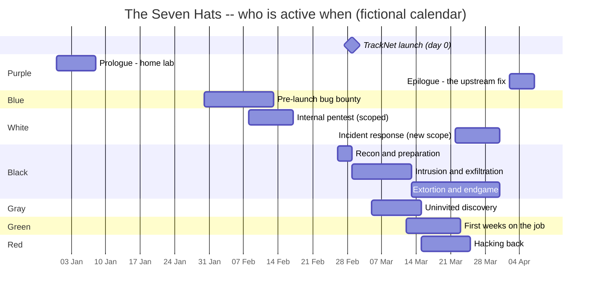

# The Seven Hats: high-level storyline

Status: **draft for review.** Nothing is implemented yet. This is the
"story bible" the seven stories will be written against. Names are working
titles.

## The premise in one paragraph

**Meridian Freight** runs the container terminal of a mid-sized port. It is
launching **TrackNet**, a customer portal that lets shippers track
containers and upload customs manifests. TrackNet is built on **portkit**,
an old open-source shipping-API library. portkit has a quiet flaw: a
manifest upload can smuggle in instructions the server executes. Over about
three months, seven people touch that flaw. Each wears a different "hat";
none of them sees the whole picture. The attacker, **Vesper**, turns it into
a campaign: steal customs manifests, then hold the terminal's crane
scheduling system for ransom. Whether Vesper gets away depends on which
traces the others left behind.

## Timeline: when each hat enters

Day 0 is TrackNet's launch, placed on a fictional calendar at 1 March 2027 so the chart
has dates; the story texts use relative days ("day -30", "day 12").

## The acts

### Prologue: the seed (day -60), Purple
**Noor**, a self-taught tinkerer, rebuilds a port's container-tracking API
in a **home lab** from open-source parts, portkit among them. She notices a
manifest upload doing something it shouldn't. She posts a vague question on
a small forum ("is this expected?") and opens a GitHub issue that nobody
answers, then moves on. *Everything that follows starts with this unanswered
issue.*

### Act I: before launch (days -30 to -12), Blue and White
- **Blue, Ines**, is **invited** to a private, time-boxed pre-launch bug
  bounty on TrackNet. On a deadline (the **engagement clock**) she finds the
  portkit flaw, with help from Noor's forum post. She reports it, and it's
  triaged "fix after launch". Her report is *buried*.
- **White, Theo**, runs a **signed internal pentest** of Meridian's office
  network. The scope explicitly **excludes TrackNet production**, and a
  forgotten staging box that syncs to it is very tempting (the **scope**
  mechanic). He flags weak segmentation between the office network and the
  terminal's operational systems. Report delivered; budget for fixes "next
  quarter".

### Act II: the launch and the intrusion (days 0 to 12), Black and Gray
- **Black, Vesper**, a small crew's operator, finds Noor's forum post while
  hunting for exploitable libraries. Vesper gets in through TrackNet on
  launch day and pivots through exactly the weak segmentation Theo flagged.
  From there Vesper plants persistence and quietly exfiltrates customs
  manifests, which are valuable to smugglers. (The **trace meter** is the
  constant pressure in Vesper's story.)
- **Gray, Kade**, an independent researcher, scans the internet for
  vulnerable portkit instances and pokes TrackNet **without permission**.
  Kade finds the flaw *and Vesper's web shell*. The dilemma: tell Meridian
  (legal risk), publish, or say nothing? Kade's first report lands in a
  shared inbox that nobody reads.

### Act III: the escalation (days 11 to 24), Green and Red
- **Green, Mika**, is two weeks into her first job on Meridian's small IT
  and security team, **learning the tools on real alerts** (a tutorial-paced
  story, like Zero Day). She notices odd logins. She finds artefacts of
  Kade's probe and Vesper's persistence, then Ines' buried report. She has
  to convince her seniors that something is wrong.
- **Vesper escalates:** ransomware on the **crane scheduling system**. The
  terminal slows to a crawl, and ships queue in the harbour.
- **Red, Rook**, a vigilante who hunts ransomware crews, traces Vesper's
  infrastructure and **hacks back** at a relay server. The relay turns out to
  be a hijacked machine at a **small clinic**, and Rook's attack knocks the
  clinic's appointment system over. Rook does come away with real evidence,
  but it was obtained illegally, and that may taint it.

### Act IV: the endgame (days 21 to 30), White again and Black
- **White, Theo**, returns for **incident response** under a new, emergency
  scope that now *includes* TrackNet. His old report becomes the map.
  Combining Mika's logs, Kade's (finally read) report and whatever of Rook's
  evidence is usable, he reconstructs Vesper's path.
- **Vesper's endgame:** the ransom deadline, collecting the money, burning
  the infrastructure. **Three endings** (see below).

### Epilogue: closing the loop (day 32 onward), Purple
**Noor** reads the news, recognises her unanswered issue, rebuilds the
attack in her home lab to understand it, and writes the **fix upstream to
portkit**. A short, reflective, open-ended story, and the end of the series.

## The seven stories at a glance

| # | Hat | Player | Enters (day) | Rough size | Core mechanic | What it conveys |
|---|---|---|---|---|---|---|
| 1 | Purple | Noor | -60 (prologue) and 32+ (epilogue) | 1 short chapter each | open-ended lab: few gates, many files | learning by building; why unanswered reports matter |
| 2 | Blue | Ines | -30 | 1-2 chapters | **engagement clock** | authorized, time-boxed testing; reports need owners |
| 3 | White | Theo | -21, again at 21 | 2 chapters | **scope** (and the out-of-scope staging box) | permission and scope; the same person, before and after |
| 4 | Black | Vesper | -3 to 30 | **3-4 chapters (the longest)** | trace meter throughout | an attacker's view; consequences |
| 5 | Gray | Kade | 4 | 2 chapters | disclosure choices, trust | responsible disclosure and its legal risk |
| 6 | Green | Mika | 11 | 2-3 chapters, tutorial pace | hints, journal, correlating logs | onboarding; noticing what others missed |
| 7 | Red | Rook | 14 | 2 chapters | trace meter, the hack-back choice | why hack-back backfires; tainted evidence |

## Vesper's three endings (the black hat story)

What decides them *inside Vesper's story* is Vesper's own opsec: which traces
Vesper cleaned up, which relays were reused, whether the ransom was taken in
a hurry. The artefacts from the other stories are what "the other side"
finds.

1. **Caught.** A reused relay, an unwiped log on the staging box, and a
   rushed ransom collection line up. Theo's reconstruction puts a name on
   Vesper, and the story ends with a knock on the door.
2. **Escaped.** Vesper burns every server on schedule, launders the payment
   patiently and disappears. Meridian recovers, but nobody is charged. Kade's
   and Mika's findings get the flaw fixed, but not the culprit.
3. **Unclear: the cliffhanger.** Vesper walks away, apparently clean. Then a
   message arrives from the client who *commissioned* the manifest theft,
   together with proof that someone **inside Meridian** fed Vesper the
   launch date. The ending doesn't say whether Vesper is safe, hunted, or
   about to be used again. This is the hook for **"The Seven Hats II"**.

The other stories have their own endings, which don't change Vesper's (see
"Links between the stories").

## Links between the stories (the "Rashomon" layer)

Every story contains **artefacts of the others**, so a player who plays
several recognises the same events from different sides:

| Artefact | Created in | Found in |
|---|---|---|
| Noor's forum post and unanswered GitHub issue | Purple (prologue) | Blue, Black, Purple (epilogue) |
| Ines' buried bug report | Blue | Green, White (incident response) |
| Theo's segmentation finding | White (pentest) | Black (the pivot), White (incident response) |
| Kade's probe in the web logs, and Kade's unread email | Gray | Green, White (incident response) |
| Vesper's web shell and persistence | Black | Gray, Green |
| The hijacked clinic relay | Black | Red |
| Rook's hack-back traffic | Red | White (incident response), Black (a warning sign) |

**Technically the stories stay independent:** no shared save state, and
each is complete on its own. The connection is narrative: consistent hosts,
names, dates and log lines. A shared "world" file (hosts, people, timeline)
keeps the seven consistent while they're written. A later, optional feature
could let one story's ending unlock a bonus scene in another.

## Content guidelines

- Everything is fictional: Meridian Freight, TrackNet, portkit and all
  people and hosts. No real companies or real vulnerabilities.
- No real-world attack techniques. The shell is simulated, and "exploiting"
  means solving story puzzles, not learning to attack real systems.
- Unauthorized hats (black, gray, red) meet real consequences, legal and
  personal. Vesper can escape, but the story never presents the harm as
  harmless: queued ships, a knocked-out clinic.
- Each story states its hat's rules in-world, e.g. the signed scope, the
  bounty terms, a lawyer's warning.

## Engine features needed first

These are from Phase 14 in `docs/ENHANCEMENT_PLAN.md`:
1. **Series metadata** (`series`, `part`, `hat`), so the story list shows
   "The Seven Hats · Part 3 of 7 · Gray Hat" and orders the series.
2. **Scope** (`scope: [...]`, `on_scope_violation`): out-of-scope hosts have
   consequences (White, and Blue's bounty terms).
3. **A labelled engagement clock:** the trace meter showing e.g. "hours left"
   instead of "trace" (Blue).

## Decisions for the owner

1. **The release order**, i.e. which story comes first. The options:
   - **A. Chronological:** Purple prologue, Blue, White, Black, Gray,
     Green, Red, then White again and Purple's epilogue. It follows the
     plot, but opens with the quietest story.
   - **B. Authorized first:** Blue and White (the new mechanics), then
     Black, Gray, Green and Red, then the epilogues. A strong start, and it
     tests scope and the clock early.
   - **C. The attacker first:** Black as the flagship, then the others as
     "the other side of the story".
2. **Names:** keep "Meridian Freight", "TrackNet", "portkit", "Vesper" and
   the rest, or rename?
3. **Scope of the first release:** everything at once as one big "The Seven
   Hats" update, or one or two stories at a time?
4. **Vesper's cliffhanger:** fine as a hook for a "Seven Hats II", or should
   the series end closed?
