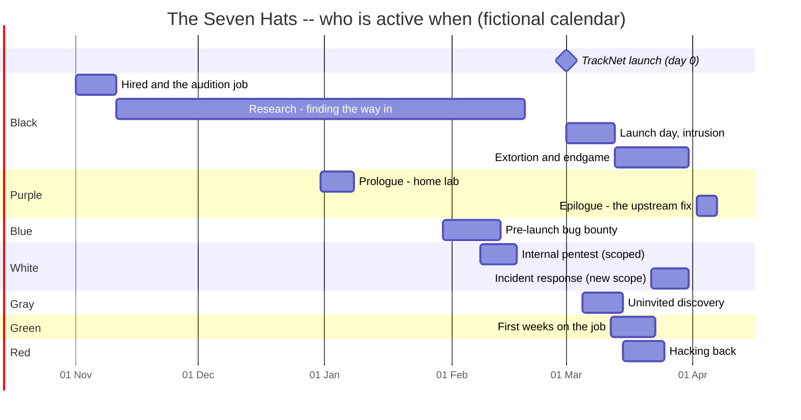

# The Seven Hats: high-level storyline

Status: **storyline agreed in outline (2026-09-27)**; no story is written yet.
This is the "story bible" the seven stories will be written against.

Decisions so far:
- Release order C: the attacker's story first.
- The black hat starts long before anyone else.
- The fictional company is **Brackwater Terminals**. The first draft's
  "Meridian Freight" is a real company name. All other names stay.
- Each story is released separately.
- Vesper's cliffhanger stays, as a sequel hook.
- New stories don't change the game's version number; see
  [Releasing stories](#releasing-stories).

## The premise in one paragraph

**Brackwater Terminals** runs the container terminal of a mid-sized estuary
port. It is launching **TrackNet**, a customer portal that lets shippers
track containers and upload customs manifests. TrackNet is built on
**portkit**, an old open-source shipping-API library with a quiet flaw: a
manifest upload can smuggle in instructions the server executes.

Months before anyone else notices anything, an anonymous client hires an
attacker, **Vesper**, to get into TrackNet. Over about five months, seven
people touch that flaw. Each wears a different "hat"; none of them sees the
whole picture. Vesper's campaign is to steal customs manifests for the
client, then hold the terminal's crane scheduling system for ransom. Whether
Vesper gets away depends on which traces the others leave behind.

## Timeline: when each hat enters

Day 0 is TrackNet's launch, placed on a fictional calendar at 1 March 2027 so
the chart has dates; the story texts use relative days ("day -120", "day
12"). Vesper is active long before and after everyone else.

## The acts

### Act 0: the job (days -120 to -1), Black alone at first
- **Day -120, hired.** On an underground forum, an anonymous client posts a
  job: "access to a port operator's shipping data, long-term". **Vesper**, a
  skilled operator trying to make a name, answers. The client wants proof
  first.
- **Day -118, the audition.** A small, contained hack the client picks: a
  forgotten test server at a fictional marine-parts supplier, with one file
  to retrieve. Vesper passes, gets the real target, **Brackwater
  Terminals**, and a first payment. (This is the story's gentle opening:
  basic shell work under a short trace meter.)
- **Days -110 to -60, research.** Vesper maps Brackwater from the outside:
  job ads ("TrackNet developer, portkit experience"), conference slides, a
  leaked staging hostname. The trail leads to portkit, and to hunting for a
  flaw in an old, sprawling codebase.
- **Day -60, Purple's prologue.** Separately, **Noor** rebuilds a port API in
  her **home lab**, notices a manifest upload doing something it shouldn't,
  and posts a vague question on a small forum ("is this expected?") plus a
  GitHub issue that nobody answers.
- **Day -57, the break.** Vesper finds Noor's post, and it's the missing
  piece. Vesper builds a working attack in a private lab.
- **Days -50 to -1, preparation.** Relays, including a hijacked server at a
  **small clinic**, drop accounts, and patience. Vesper waits for the launch
  date. The client *knows* the launch date before it's public, and that
  small oddity pays off in the cliffhanger.

### Act I: before launch (days -30 to -12), Blue and White
- **Blue, Ines**, is **invited** to a private, time-boxed pre-launch bug
  bounty on TrackNet. On a deadline (the **engagement clock**) she finds the
  portkit flaw, with help from Noor's forum post. She reports it, and it's
  triaged "fix after launch". Her report is *buried*.
- **White, Theo**, runs a **signed internal pentest** of Brackwater's office
  network. The scope explicitly **excludes TrackNet production**, and a
  forgotten staging box that syncs to it is very tempting (the **scope**
  mechanic). He flags weak segmentation between the office network and the
  terminal's operational systems. Report delivered; fixes "next quarter".

### Act II: the launch and the intrusion (days 0 to 12), Black and Gray
- **Vesper strikes on launch day** through TrackNet and pivots through
  exactly the weak segmentation Theo flagged. From there Vesper plants
  persistence and quietly exfiltrates customs manifests for the client.
  (The **trace meter** is the constant pressure.)
- **Gray, Kade**, an independent researcher, scans the internet for
  vulnerable portkit instances and pokes TrackNet **without permission**.
  Kade finds the flaw *and Vesper's web shell*. Tell Brackwater (legal
  risk), publish, or say nothing? Kade's first report lands in a shared
  inbox that nobody reads.

### Act III: the escalation (days 11 to 24), Green and Red
- **Green, Mika**, is two weeks into her first job on Brackwater's small IT
  and security team, **learning the tools on real alerts** (a tutorial-paced
  story, like Zero Day). She finds artefacts of Kade's probe and Vesper's
  persistence, then Ines' buried report, and has to convince her seniors.
- **Vesper escalates:** ransomware on the **crane scheduling system**. The
  terminal slows to a crawl, and ships queue in the estuary.
- **Red, Rook**, a vigilante who hunts ransomware crews, traces Vesper's
  infrastructure and **hacks back** at a relay: the hijacked **clinic**
  server. Rook's attack knocks the clinic's appointment system over. Rook
  does come away with evidence, but it was obtained illegally.

### Act IV: the endgame (days 21 to 30), White again and Black
- **White, Theo**, returns for **incident response** under a new, emergency
  scope that now *includes* TrackNet. His old report is the map. With Mika's
  logs, Kade's (finally read) report and whatever of Rook's evidence is
  usable, he reconstructs Vesper's path.
- **Vesper's endgame:** the ransom deadline, the payment, burning the
  infrastructure. **Three endings** (below).

### Epilogue: closing the loop (day 32 onward), Purple
**Noor** reads the news, recognises her unanswered issue, rebuilds the
attack in her home lab to understand it, and writes the **fix upstream to
portkit**. A short, reflective story, and the end of the series.

## The seven stories, in release order (option C)

Release order C: the attacker first, then "the other side of the story" in
the order its characters enter. Part numbers follow the release order.

| Part | Hat | Player | Active (days) | Rough size | Core mechanic | What it conveys |
|---|---|---|---|---|---|---|
| 1 | **Black** | Vesper | -120 to 30 | **5 chapters: audition, research, launch day, escalation, endgame** | trace meter throughout; the opsec choices decide the ending | an attacker's view, from first job to consequences |
| 2 | Blue | Ines | -30 to -16 | 1-2 chapters | **engagement clock** | authorized, time-boxed testing; reports need owners |
| 3 | White | Theo | -21 to -12, 21 to 30 | 2 chapters | **scope** (the out-of-scope staging box) | permission and scope; the same person before and after |
| 4 | Gray | Kade | 4 to 14 | 2 chapters | disclosure choices, trust | responsible disclosure and its legal risk |
| 5 | Green | Mika | 11 to 22 | 2-3 chapters, tutorial pace | hints, journal, correlating logs | onboarding; noticing what others missed |
| 6 | Red | Rook | 14 to 24 | 2 chapters | trace meter, the hack-back choice | why hack-back backfires; tainted evidence |
| 7 | Purple | Noor | -60, then 32+ | prologue and epilogue chapters | open-ended lab, few gates | learning by building; why unanswered reports matter |

Purple comes last even though its prologue is early: its epilogue closes
the series, and its prologue gains weight once players know what the
unanswered issue caused.

## Vesper's three endings

What decides them *inside Vesper's story* is Vesper's own opsec across all
five chapters: which traces were cleaned up, whether relays were reused,
whether the ransom was taken in a hurry. The artefacts in the other stories
are what "the other side" found.

1. **Caught.** A reused relay, an unwiped log on the staging box and a rushed
   ransom collection line up. Theo's reconstruction puts a name on Vesper,
   and the story ends with a knock on the door.
2. **Escaped.** Vesper burns every server on schedule, launders the payment
   patiently and disappears. Brackwater recovers, but nobody is charged.
3. **Unclear: the cliffhanger.** Vesper walks away, apparently clean. Then a
   message arrives from the client who hired Vesper back on day -120,
   together with proof that someone **inside Brackwater** fed the client
   the launch date. The ending doesn't say whether Vesper is safe, hunted, or
   about to be used again. This is the hook for **"The Seven Hats II"**.

The other stories have their own endings and don't change Vesper's.

## Links between the stories (the "Rashomon" layer)

| Artefact | Created in | Found in |
|---|---|---|
| The client's job post and the audition target | Black (act 0) | Black; later Red (the same forum handle) |
| Noor's forum post and unanswered GitHub issue | Purple (prologue) | Black (the break), Blue, Purple (epilogue) |
| Ines' buried bug report | Blue | Green, White (incident response) |
| Theo's segmentation finding | White (pentest) | Black (the pivot), White (incident response) |
| Kade's probe in the web logs, and Kade's unread email | Gray | Green, White (incident response) |
| Vesper's web shell and persistence | Black | Gray, Green |
| The hijacked clinic relay | Black (preparation) | Red |
| Rook's hack-back traffic | Red | White (incident response), Black (a warning sign) |
| The early launch date the client knew | Black (act 0) | Black (the cliffhanger); the sequel |

**Technically the stories stay independent:** no shared save state, and
each is complete on its own. The connection is narrative: consistent hosts,
names, dates and log lines, kept in one shared "world" file while writing.

## Content guidelines

- Everything is fictional: Brackwater Terminals, TrackNet, portkit, the
  audition target, and all people and hosts. No real companies or real
  vulnerabilities. Names are checked against real companies before use.
- No real-world attack techniques. The shell is simulated, and "hacking"
  means solving story puzzles, not learning to attack real systems.
- Unauthorized hats (black, gray, red) meet real consequences. Vesper can
  escape, but the harm is never presented as harmless: queued ships, a
  knocked-out clinic.
- Each story states its hat's rules in-world, e.g. the client's terms, the
  bounty terms, the signed scope, a lawyer's warning.

## Releasing stories

Owner decision: **new stories don't change the game's version number.**
Each story is released separately, and the game version changes only for
engine or player-facing code changes.

- **Browser version:** a story is live as soon as it's merged, because the
  site deploys from `main` without a release.
- **Installed copies (PyPI):** stories ship inside the package today, so an
  installed game only sees new stories when the game itself is re-released.
  To reach terminal players without a game release, the stories need their
  own delivery channel. That is a new Phase 12 item: the game downloads
  published stories into the user stories folder, e.g. `sidechannel
  stories update`.
- **Bookkeeping:** each story carries its own version in its manifest (e.g.
  `version: 1`, bumped when a story is revised), and the changelog gets a
  "Stories" section alongside the game versions.

## Engine features needed first

From Phase 14 in `docs/ENHANCEMENT_PLAN.md`:
1. **Series metadata** (`series`, `part`, `hat`), so the story list shows
   "The Seven Hats · Part 1 of 7 · Black Hat" and orders the series by part.
2. **Scope** (`scope: [...]`, `on_scope_violation`) for White, and for
   Blue's bounty terms.
3. **A labelled engagement clock:** the trace meter showing e.g. "hours
   left" (Blue).
4. **Story delivery** independent of the game version (Phase 12), so terminal
   players get separately released stories.

Part 1 (Black) needs only the series metadata; it runs on today's engine.
Scope and the clock can come right before Parts 2 and 3.
